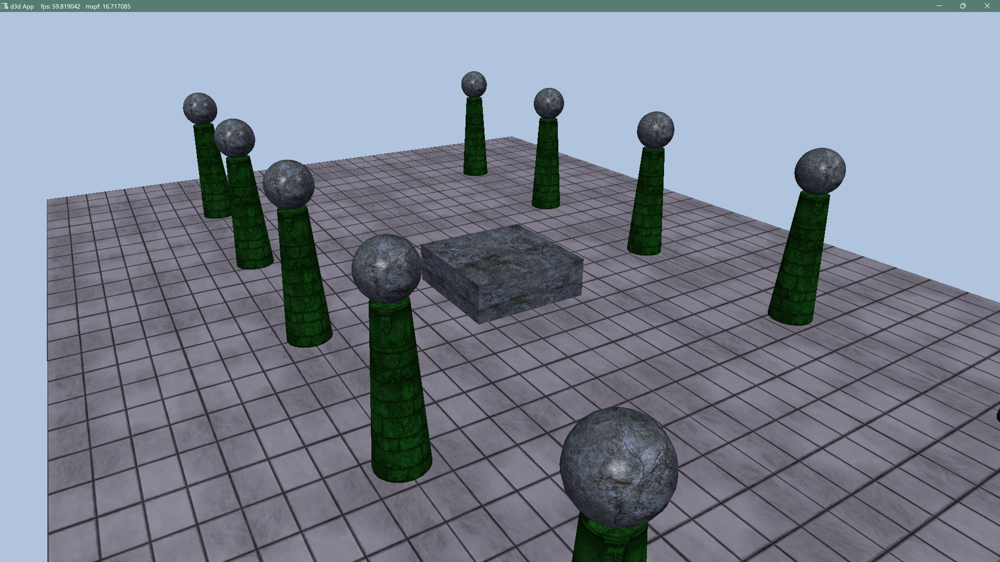

# LearnDirect3D12 :yum:
### Ref
- [d3dcodernet](https://www.d3dcoder.net)
- [a study path for game-programmer](https://github.com/miloyip/game-programmer.git)
- [Direct3D 12 graphics](https://learn.microsoft.com/en-us/windows/win32/direct3d12/direct3d-12-graphics)

Record my journey of learning CG with "Dragon Book" :dragon_face:.  
I use this book *"Introduction to 3D Game Programming with Direct3D 12"*.  

### Demo List

#### Ch9 Texturing

```
git checkout prac_9
```
Open **Crate.sln** and find ***CrateApp::AnimateMaterials(...)*** and **Default.hlsl** for more details.

<div align="center">
  
</div>

Open **LitColumns.sln** and run.

<div align="center">
	
</div>